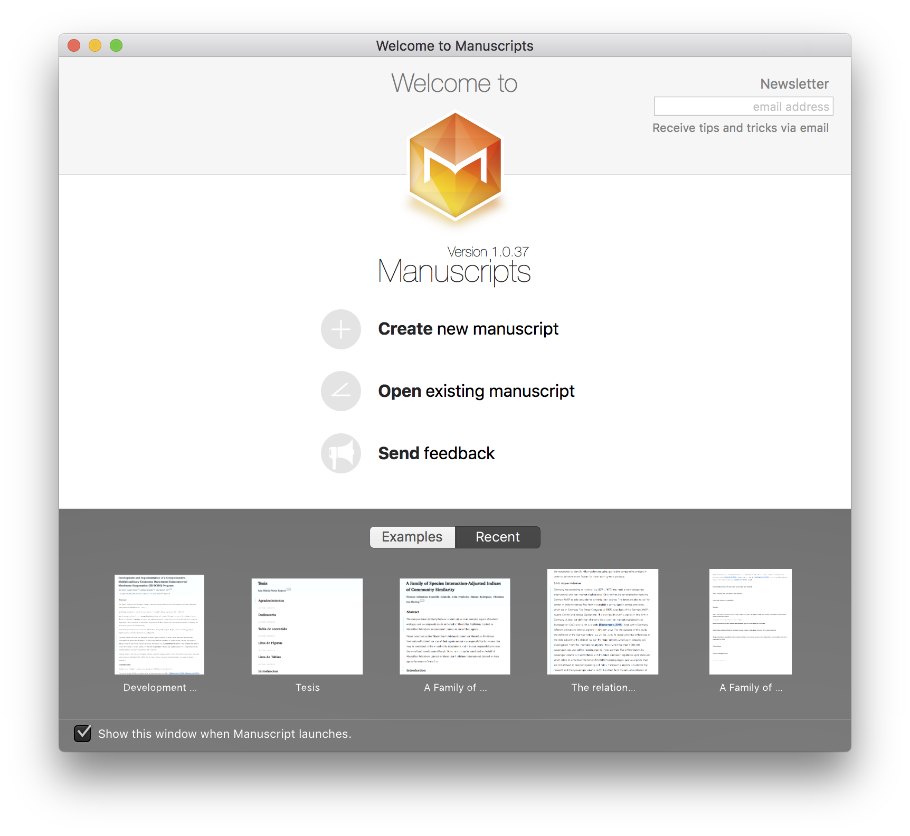

# MPSheetView

A one line tall collection view built in SceneKit. It looks like this:



For a quick demo of of it, watch my NSConference 7 SceneKit intro talk (2015): https://vimeo.com/124317401

### Carthage

[Carthage](https://github.com/Carthage/Carthage) is a decentralized dependency manager that builds your dependencies and provides you with binary frameworks.

You can install Carthage with [Homebrew](http://brew.sh/) using the following command:

```bash
$ brew update
$ brew install carthage
```

To integrate MPSheetView into your Xcode project using Carthage, specify it in your `Cartfile`:

```ogdl
github "mpapp/MPSheetView" ~> 1.0
```

Run `carthage update` to build the framework and drag the built `MPSheetView.framework` into your Xcode project.

You'll want to also link SceneKit into the build target that uses MPSheetView.
